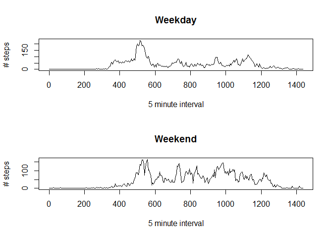

## Loading and preprocessing the data

### Load the data


```r
data <- read.csv("activity.csv")
```

### Process/transform the data into a format suitable for your analysis

`data$interval` is like `rep(0:11 * 5, 24) + rep(0:23 * 100, each=12)`  
viz. like 0, 5, ..., 50, 55, 100, 105, ...  
we want it like 0, 5, ..., 50, 55, 60, 65, ...

This is so that we can make time series plots (otherwise the jump from 55 to 100 makes a difficulty).

We also want it to be a factor variable, but we want to keep the original `interval` column, so we call our new factor `interval_new`. There is no real need to turn our old `interval` column into a factor, but we will anyway.


```r
data$interval <- as.factor(data$interval)
data$interval_new <- as.factor(rep(0:287 * 5, 61))
```

### Taking a look at the dataset


```r
## Take a look at the data:
dim(data)
```

```
## [1] 17568     4
```

```r
str(data)
```

```
## 'data.frame':	17568 obs. of  4 variables:
##  $ steps       : int  NA NA NA NA NA NA NA NA NA NA ...
##  $ date        : Factor w/ 61 levels "2012-10-01","2012-10-02",..: 1 1 1 1 1 1 1 1 1 1 ...
##  $ interval    : Factor w/ 288 levels "0","5","10","15",..: 1 2 3 4 5 6 7 8 9 10 ...
##  $ interval_new: Factor w/ 288 levels "0","5","10","15",..: 1 2 3 4 5 6 7 8 9 10 ...
```


## What is mean total number of steps taken per day?

Ignore any missing values.

### Histogram of the total number of steps taken each day


```r
library(lattice)
total <- tapply(data$steps, data$date, sum, na.rm=TRUE)
hist(total, breaks=22, col="red", main="",
    xlab="total number of steps taken each day")
```

<!-- -->

A lot of zero values.

### The *mean* and *median* total number of steps taken per day


```r
mean_orig <- mean(total)
median_orig <- median(total)
print(paste("Mean is:", mean_orig, ";  Median is:", median_orig))
```

```
## [1] "Mean is: 9354.22950819672 ;  Median is: 10395"
```


## What is the average daily activity pattern?

### Time Series Plot

5-minute interval on the x-axis; average number of steps taken (averaged across all days) on the y-axis.


```r
intervals <- tapply(data$steps, data$interval_new, mean, na.rm=TRUE)
plot(intervals~levels(data$interval_new), type="l",
    main="Average number of steps taken in each 5 minute interval",
    xlab="5 minute interval",
    ylab="number of steps (averaged across all days)")
```

<!-- -->

The time series plot would not come out right if we used the original `data$interval` column (because of the jumps from, e.g. 55 to 100, meaning from the 55 mark to the 1 hour mark). `data$interval_new` fixes this by putting the number of minutes on the x-axis, e.g. going from 55 to 60, so the highest value is 1435 (1440-5), instead of 2355 (24:00-5) as in the original data.

### The 5-minute interval which contains the most steps

The 5-minute interval which on average across all the days in the dataset contains the maximum number of steps:


```r
temp <- data$interval_new[which.max(intervals)]
temp <- as.numeric(levels(data$interval))[temp]
paste("the interval from", temp, "to", temp+5, "contains the greatest number of steps, averaged over all the days.")
```

```
## [1] "the interval from 835 to 840 contains the greatest number of steps, averaged over all the days."
```

This prints out using the original `data$interval` format, i.e. 835 to 840 means 08:35 to 08:40. I guess our guy walks to work.


## Imputing missing values

Note that there are a number of days/intervals where there are missing values (coded as `NA`). The presence of missing days may introduce bias into some calculations or summaries of the data.

### total number of missing values

The total number of rows in the dataset with NAs:


```r
sum(is.na(data))
```

```
## [1] 2304
```

The percentage of rows in the dataset with NAs:


```r
sum(is.na(data)) / length(data$steps) * 100
```

```
## [1] 13.11475
```

### strategy for filling in all of the missing values

Devise a strategy for filling in all of the missing values in the dataset. The strategy does not need to be sophisticated.

*Here we use the mean for each 5-minute interval.*


```r
## same as before
intervals <- tapply(data$steps, data$interval_new, mean, na.rm=TRUE)
intervals <- rep(intervals, 61)
```

### new dataset with missing values filled in

Create a new dataset that is equal to the original dataset but with the missing data filled in.


```r
data_new <- data        ## make new dataset
data_new$steps <- ifelse(is.na(data_new$steps), intervals, data_new$steps)
```

### histogram of the total number of steps taken each day


```r
## same code as above, but with filled-in dataset
total_new <- tapply(data_new$steps, data_new$date, sum)    ## na.rm=FALSE
hist(total_new, breaks=22, col="red", main="",
    xlab="total number of steps taken each day")
```

<!-- -->

There is no longer the large number of zero values (which were probably caused by NAs).  
The center spike is also a good bit higher.

### the *mean* and *median* total number of steps taken per day


```r
mean_new <- mean(total_new)
median_new <- median(total_new)
print(paste("Mean is:", mean_new, ";  Median is:", median_new))
```

```
## [1] "Mean is: 10766.1886792453 ;  Median is: 10766.1886792453"
```

### Report on impact of imputing missing data

***Do these values differ from the estimates from the first part of the assignment?***  
Answer = Yes, the funny thing is that the mean and the median are now the same!  
I think this has something to do with filling in the data using the mean value for each interval.

***What is the impact of imputing missing data on the estimates of the total daily number of steps?***  
Answer = The mean and the median are a bit higher when calculated using imputed missing data, but the difference is not very great.


```r
print(paste("New mean:", mean_new, "(old:", mean_orig,
    ");"))
```

```
## [1] "New mean: 10766.1886792453 (old: 9354.22950819672 );"
```

```r
print(paste("New median:", median_new, "(old:", median_orig, ")."))
```

```
## [1] "New median: 10766.1886792453 (old: 10395 )."
```


## Are there differences in activity patterns between weekdays and weekends?

*Using the dataset with the filled-in missing values.*

### weekend vs. weekday

Create a new factor variable in the dataset with two levels -- "weekday" and "weekend" indicating whether a given date is a weekday or weekend day.


```r
levels <- c("Monday", "Tuesday", "Wednesday", "Thursday",
    "Friday", "Saturday", "Sunday")
labels <- c("weekday", "weekday", "weekday", "weekday",
    "weekday", "weekend", "weekend")
data_new$weekdays <- weekdays(as.Date(data_new$date))
data_new$weekdays <- factor(data_new$weekdays, levels=levels, labels=labels)
```

### Time Series Plots

Make a panel plot containing a time series plot (i.e. `type = "l"`) of the 5-minute interval (x-axis) and the average number of steps taken, averaged across all weekday days or weekend days (y-axis).

### Average number of steps taken in each 5 minute interval (weekday vs. weekend)


```r
temp_new <- tapply(data_new$steps,
    list(data_new$interval_new, data_new$weekdays), mean)
par(mfrow=c(2, 1))
plot(temp_new[,"weekday"]~levels(data_new$interval_new), type="l",
    main="Weekday",
    xlab="5 minute interval",
    ylab="# steps")
plot(temp_new[,"weekend"]~levels(data_new$interval_new), type="l",
    main="Weekend",
    xlab="5 minute interval",
    ylab="# steps")
```

<!-- -->

There are definite differences in activity pattern between weekdays and weekend.

There is a high burst of activity on weekday mornings, which doesn't occur as much on weekends. In general the bulk of activity at weekends starts a bit later and ends a bit later than on weekdays, and there is more activity overall at the weekend.

----

This document was processed on: 2020-06-17.
